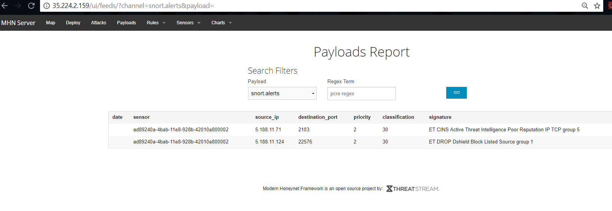

# Web-Security-Week9

# Project 9 - Honeypot

Time spent: **14** hours spent in total

> Objective: Setup a Honeypot Using Google Cloud Platform and demonstrate it's effectiveness at intercepting attempted attacks.

## Description

A step-by-step procedure was provided by codepath to deploy honeypots using Modern Honey Network (mhn).

## Which Honeypot was deployed:
- dionaea
- snort


## Issues that were encountered

Some of the directions in the project were a bit confusing but the supplied commands were very helpful.  

The greatest hurdle I encountered was setting up the MHN VM specifically an error that was encounntered when running the following command  ```sudo ./install.sh```. It would not prompt for the MHN configuration and would timeout after a few minutes. 

MY mhn-admin VM kept disconnecting quite alot, thereby preventing ssh to browser succesfully. 

## Report/Summary of data collected: number of attacks, number of malware samples, etc.





## Unresolved Questions and Comments
Not sure how to determine which attacks were malware. How can this be done?

Attached is the session.json file to show the data collected from honeypots.

